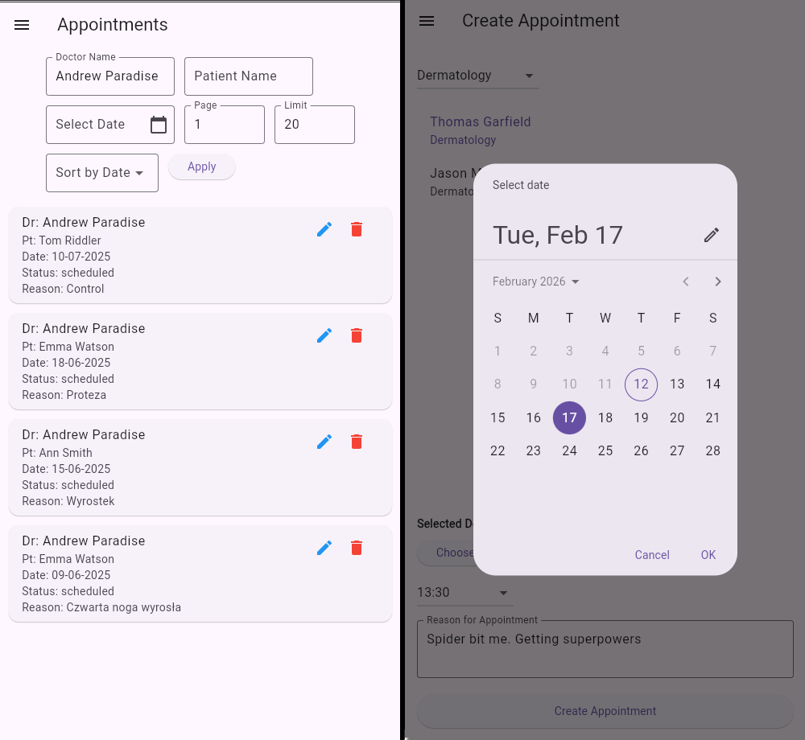

# 🏥 Clinic SPA — Full-Stack Medical Appointment System

**One-line:** A cross-platform Single Page Application for managing medical appointments — a single Flutter codebase (Web + Android) backed by a Node/Express REST API and MongoDB, with role-based access and modern Google Sign-In support.

---

## Project summary

Clinic SPA simulates real clinical workflows and demonstrates full-stack engineering best practices. It models three roles — **patient**, **doctor**, **admin** — and provides secure appointment booking and management, doctor discovery/filtering, and account management while enforcing permissions server-side.

---



---

## Key features

* **Cross-platform client:** single Flutter codebase that runs on **Web** and **Android**.
* **Role model & permissions:** server-enforced roles (`patient`, `doctor`, `admin`) with role-specific UI and actions.
* **Appointments:** list, filtered search, create (doctor selection by specialty), update, delete. Patients can manage their own appointments; doctors and admins have extended capabilities.
* **Doctors & patients management:** browse, filter, view, and (with permissions) create/update/delete.
* **Authentication:** email/password (bcrypt + JWT) and **Google Sign-In** — Web via Google Identity Services (`renderButton()`), mobile via `google_sign_in` with `serverClientId`.
* **Secure token handling:** JWT storage in secure local storage on client and Authorization header usage.
* **Robust error handling:** user feedback for network/API failures and graceful UI states.

---

## Technologies

* **Frontend:** Flutter (Dart), Provider, flutter_secure_storage
* **Authentication / OAuth:** google_sign_in (mobile), google_sign_in_web / Google Identity Services (web)
* **Backend:** Node.js, Express, Mongoose (MongoDB), bcrypt, jsonwebtoken, google-auth-library
* **Other tools:** adb (device debugging), ngrok (optional), Postman / curl for API testing

---

## Architecture (high level)

```
[Flutter client (Web + Android)]
     └─ api_service.dart (HTTP client, token management)
         └─ REST API (Node/Express)
               ├─ /api/auth         (email + Google verification)
               ├─ /api/appointments
               ├─ /api/doctors
               └─ /api/patients
               └─ JWT auth middleware -> MongoDB (Mongoose models)
```

---

## My role

* Designed the **REST API**, Mongoose schemas and authorization logic.
* Implemented the **Node/Express controllers**, including validation and role checks.
* Built the **Flutter client**: login/register flows, **5 distinct views** (appointments, doctors, patients, profile, create/edit appointment), navigation drawer and state management (Provider).
* Integrated **Google Sign-In on both Web and Android**, including the web migration to Google Identity Services (GSI) and conditional platform code so Android builds remain clean.
* Implemented production-relevant **dev workflows**: local device testing with `adb reverse`, web hosting considerations, and secure JWT flow with `flutter_secure_storage`.

---

## Notable technical challenges & solutions

* **Google Sign-In cross-platform:** migrated Web flow to GSI `renderButton()` and used `onCurrentUserChanged` to receive tokens; on mobile used `serverClientId` to obtain `idToken`.
* **Avoiding web-only imports on Android:** used conditional exports and platform-specific files (`google_button_web.dart` / `google_button_mobile.dart`) so builds stay clean.
* **Local device API access:** used `adb reverse` for USB device testing and provided a LAN fallback when needed.
* **Schema evolution:** adjusted Mongoose schema and controllers to support both local and Google-authenticated accounts without requiring unnecessary fields.

---